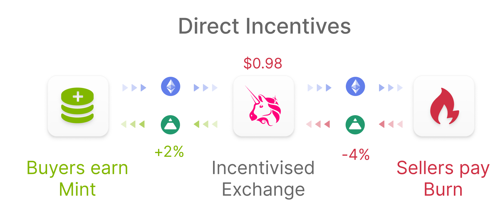
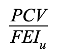

# Cowrie Stablecoin

## Design

COWRIE \(Cowrie USD\) is designed to allow for flexible upgrades and arbitrary incentive mechanisms to support the $1 peg target. 

Its issuance is controlled by the Minter💰role, and any contract with this role can mint COWRIE to any address. The Burner🔥 role can burn COWRIE from any address, and is utilized for deflation and disincentives. 

## Direct Incentives

Cowrie Protocol uses the Direct Incentive approach to peg stability. This means that user actions can lead to a mint or burn of COWRIE from their wallet. The magnitude and direction of the incentive is based on the action taken and the market conditions at the time. 

The Direct Incentives are applied only when interacting with an _incentivized address_. When COWRIE is transferred to or from an __incentivized address, the corresponding _incentive contract_ is called, which is either a Minter💰, a Burner🔥, or both. The only incentivized address at launch is the ETH/COWRIE Uniswap v2 Pair and its incentive contract is [UniswapIncentive](uniswapincentive.md).

The Governor⚖️ can set and unset incentive contracts for any address. It can also exempt addresses from incentives.

### Inclusive Fee On Transfer

Fees applied to incentivized trading or transfers can be either inclusive or exclusive. The inclusive fees are more commonly utilized in DeFi. Inclusive fees are applied "in-flight", meaning that the fee is extracted from the transfer or the trade amount itself.  Exclusive fees are applied on top of the transfer or trade amount itself. The exclusive fee is commonly applied to the party initiating the transaction.

Cowrie Protocol v1 uses an "inclusive" fee on transfers when applying Direct Incentives on Uniswap sells. There are certain considerations with this approach, the main one being that Cowrie Protocol cannot differentiate between selling and liquidity provision. Therefore the fee applies to all COWRIE transfers to the pool including providing LP.


LPing the COWRIE/ETH Uniswap pool also incurs a burn penalty, because it transfers COWRIE into the pool like a sell would


## Collateralization

The COWRIE stablecoin is collateralized by a [PCV](../protocol-controlled-value/) reserve. Cowrie Protocol prioritizes liquidity when deploying this reserve to make sure users are able to trade COWRIE at high volume. 

Critically, COWRIE can be over- or under-collateralized depending on volatility on the PCV and other market conditions.

The collateralization ratio of COWRIE at any time is calculated as follows, with the denominator being "User controlled COWRIE":

The formula ignores "Protocol controlled COWRIE" because any COWRIE that the protocol holds will never be sold for PCV, only burned. Protocol controlled COWRIE can have second-order, short-term inflationary effects. For instance, COWRIE deposited into a lending market by Cowrie Protocol could increase the circulating supply when borrowed. The interest accrued and eventual withdrawal of that COWRIE ultimately have a net deflationary effect in the long term.

